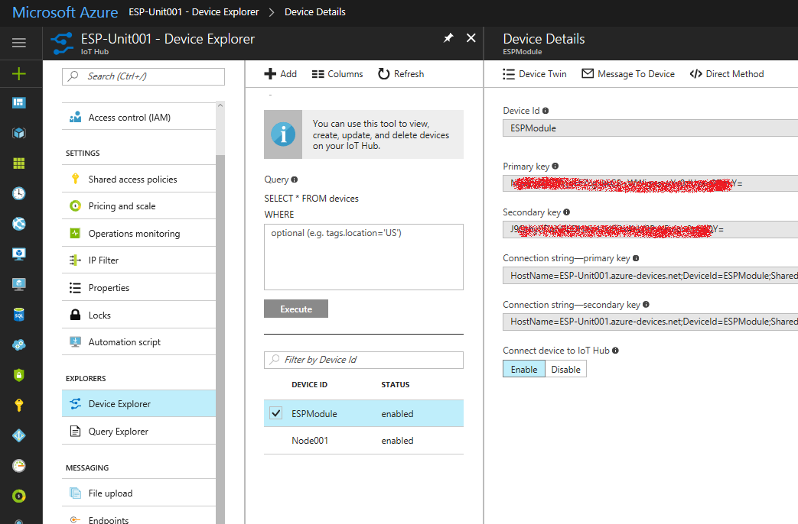
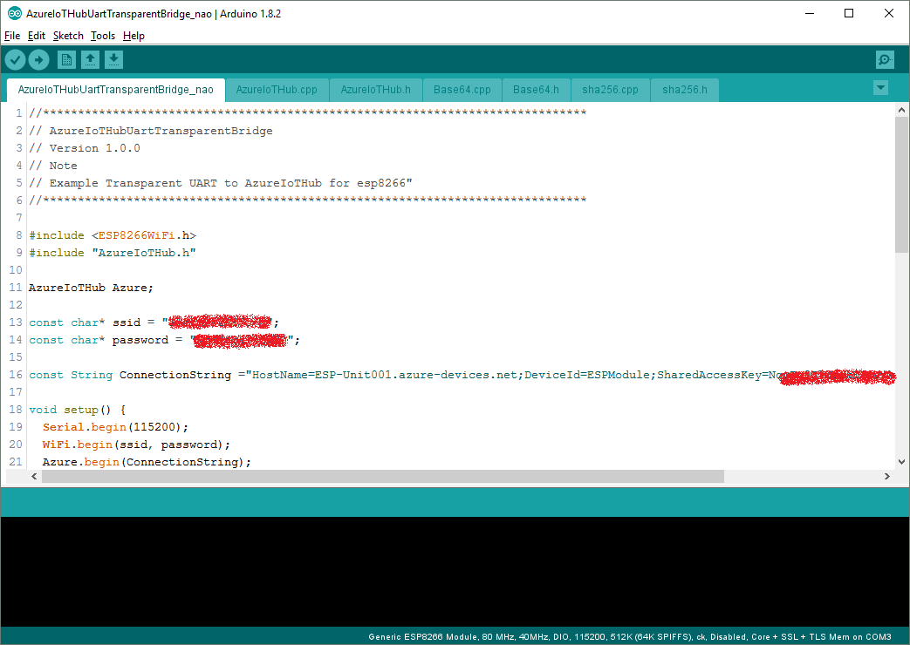
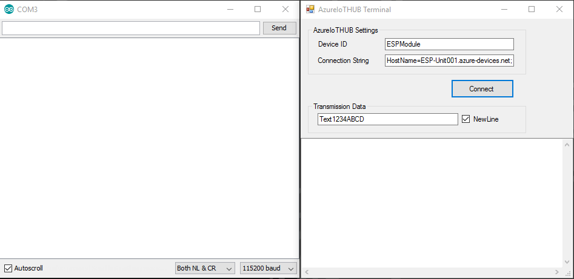

# ESP8266-Azure-IoT-Hub-UART-transparent-bridge
Serial communication over the internet using Azure IoTHub.
This sample used [pubsubclient](https://github.com/knolleary/pubsubclient) library, is as a transparent serial to Azure IoTHub bridge.

To communicate AzureIoTHub devices, I created a small sample project [Azure-IoT-Hub-Simple-Terminal](https://github.com/NaoNaoMe/Azure-IoT-Hub-Simple-Terminal).
You can also use [DeviceExplorer](https://github.com/Azure/azure-iot-sdk-csharp/tree/master/tools/DeviceExplorer).

## How to use
First, you need to setup Azure IoTHub services. [This tutorial](https://docs.microsoft.com/en-us/azure/iot-hub/iot-hub-arduino-huzzah-esp8266-get-started)
 is very helpful how to setup Azure IoTHub, or many instructions about Azure IoTHub on the internet. If you just want to try Auzre IoTHub, you'd better choose Pricing and scale tier: Select the F1 - Free tier.

When your IoTHub device created, you could see its details from Device Explorer the shown below : 
To setup ESP8266-AzureIoTHub-UART-transparent-bridge sketch, copy the Connection String primary key.

  

You modify ssid, password, and the Connection String in ESP8266-AzureIoTHub-UART-transparent-bridge.ino and upload it to esp8266.
After uploading, the esp8266 will be ready to communicate with Azure IoTHub.

  

## Demo
The following demonstration shows using [ESP8266-AzureIoTHub-UART-transparent-bridge](https://github.com/NaoNaoMe/ESP8266-AzureIoTHub-UART-transparent-bridge) and [Azure-IoT-Hub-Simple-Terminal](https://github.com/NaoNaoMe/Azure-IoT-Hub-Simple-Terminal).

  

## Reference Repositories
[Azure-iothub-mqtt-esp8266](https://github.com/wamisnet/Azure-iothub-mqtt-esp8266)
